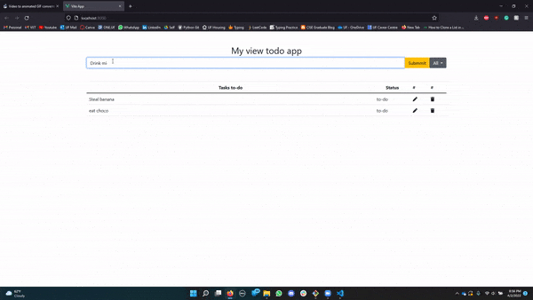

# Checklist Website

> This is the Javascript website application 

> This is the VueJS website application 

---

## Table of Contents

- [Description](#description)
- [Javascript](#javascript)
- [VueJS](#vuejs)
- [License](#license)
- [Author Info](#author-info)

---

## Description

Every bigginer who wants to learn webdevelopment starts with a checklist application. This is a checklist app, make in Javascript as well as VueJS, I have done this to best understand the differences and advantages or disadvantages of both.

#### Technologies

- Javascript
- VueJS
- Bootstrap
- HTML
- CSS

[Back To The Top](#checklist-website)

---

## Javascript

Here I have used very basic Javascript programming. Pls look at the [HTML](Javascript/index.html) file, and the [app.js](Javascript/app.js) file for best understanding. In app.js you will be able to see 3 sections selectors, event listners and funstions.

[Back To The Top](#checklist-website)

---

## VueJS

You will be able to see in [App.vue](VueJS/checklist/src/App.vue) I have called a component [todoApp.vue](VueJS/checklist/src/components/todoApp.vue). Here you can see some HTLM code with a few functions below it. 

[Back To The Top](#checklist-website)

---

## License

MIT License

Copyright (c) [2017] [Taher H Mulla]

Permission is hereby granted, free of charge, to any person obtaining a copy
of this software and associated documentation files (the "Software"), to deal
in the Software without restriction, including without limitation the rights
to use, copy, modify, merge, publish, distribute, sublicense, and/or sell
copies of the Software, and to permit persons to whom the Software is
furnished to do so, subject to the following conditions:

The above copyright notice and this permission notice shall be included in all
copies or substantial portions of the Software.

THE SOFTWARE IS PROVIDED "AS IS", WITHOUT WARRANTY OF ANY KIND, EXPRESS OR
IMPLIED, INCLUDING BUT NOT LIMITED TO THE WARRANTIES OF MERCHANTABILITY,
FITNESS FOR A PARTICULAR PURPOSE AND NONINFRINGEMENT. IN NO EVENT SHALL THE
AUTHORS OR COPYRIGHT HOLDERS BE LIABLE FOR ANY CLAIM, DAMAGES OR OTHER
LIABILITY, WHETHER IN AN ACTION OF CONTRACT, TORT OR OTHERWISE, ARISING FROM,
OUT OF OR IN CONNECTION WITH THE SOFTWARE OR THE USE OR OTHER DEALINGS IN THE
SOFTWARE.

[Back To The Top](#checklist-website)

---

## Author Info

 - [Linkdin](https://www.linkedin.com/in/taher-mulla) 

 - [GitHub](https://github.com/taher-mulla)

 - Email - taher.mulla@gmail.co

[Back To The Top](#checklist-website)
